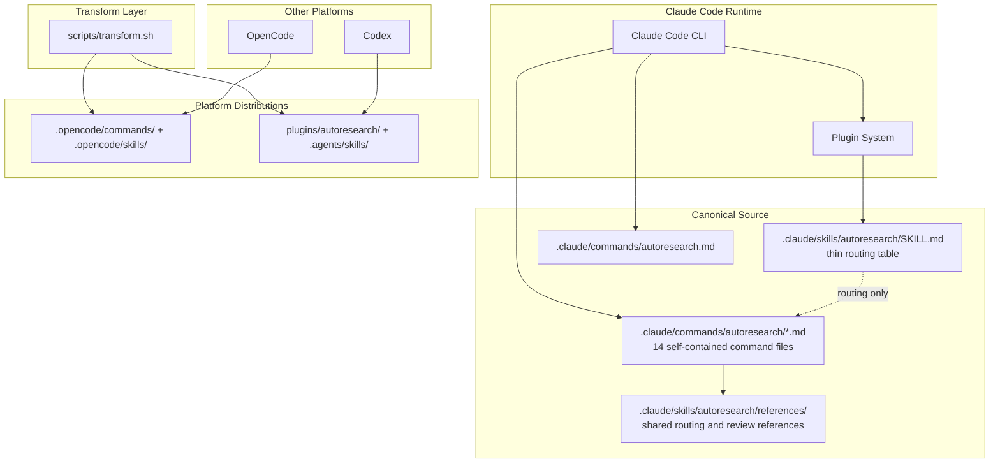
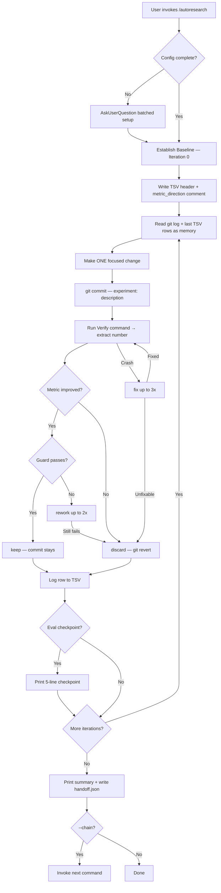
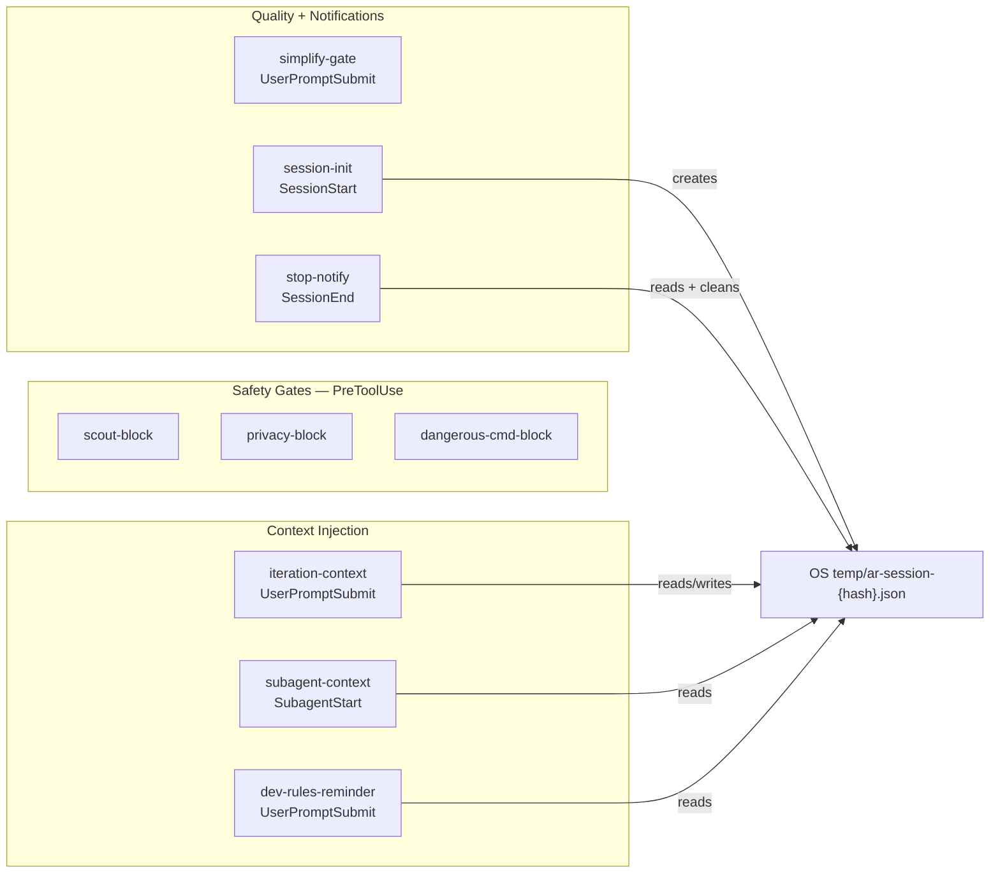

# System Architecture

## Overview

Autoresearch v2.2.2 is a modular, markdown-driven autonomous iteration framework. The core architectural shift from v2.0.x is the **thin SKILL.md + self-contained command files** pattern: the skill file is a routing table; all protocol is embedded in 14 self-contained command files. Only the invoked command file loads per invocation, reducing token cost by ~95%.

As of v2.2.0, bare `/autoresearch` is overloaded: a `Metric:`/`Verify:` config runs the classic metric loop unchanged, while a free-form natural-language goal dispatches an **autonomous orchestrator** that classifies the goal, derives a success predicate, and loops the right subcommands until it holds. All routing decisions live in one deterministic seam, `scripts/orchestrate.sh` (mirroring the `scripts/score-regression.sh` pattern), bounded by plateau detection and a hard cycle ceiling.

v2.2.1 hardens that seam with four orchestrator-safety additions: `screen-cmd` gains destructive-command coverage (netcat exfiltration, raw block-device writes across SD/eMMC·RAID·device-mapper families, `mkfs`, `find -delete`, `shred`, zero-`truncate`, recursive zero-mode `chmod`, curl/wget-into-interpreter via xargs) — including path-qualified invocations like `/sbin/mkfs.ext4`; the derived Success predicate is **pinned** verbatim into `orchestrator-state.json` and re-screened on resume via the new `screen-state-predicate` subcommand (extraction honors escaped quotes so a poisoned predicate cannot truncate the screen); a new `validate-state` subcommand gates the ledger (required fields + coarse types) before routing; and `next-hop` routes a high-impact accepted change through an independent **verify** hop (`pending_verify`) before declaring `DONE` or shipping. The seam now exposes eight subcommands: `classify`, `next-hop`, `units`, `plateau`, `screen-cmd`, `verdict`, `validate-state`, `screen-state-predicate`.

Multi-platform: Claude Code, OpenCode, and Codex are all supported via a single `scripts/transform.sh` that produces platform-specific distributions from the canonical `.claude/` source and refreshes bundled runtime helpers inside each generated skill package.

## Component Diagram



## Data Flow — Core Autoresearch Loop



## Directory Structure

```
.claude/
├── commands/
│   ├── autoresearch.md                    # Core loop command — self-contained, 110 lines
│   └── autoresearch/
│       ├── debug.md                       # Hypothesis iteration loop
│       ├── evals.md                       # One-shot TSV analysis (NEW in v2.1.0)
│       ├── fix.md                         # Error-count reduction loop
│       ├── learn.md                       # Doc generation loop
│       ├── plan.md                        # Goal-to-config wizard
│       ├── predict.md                     # 5-persona one-shot debate
│       ├── improve.md                     # Product improvement research + PRD generation
│       ├── probe.md                       # Requirement interrogation loop
│       ├── reason.md                      # Adversarial refinement loop
│       ├── regression.md                  # Baseline/candidate stability gate
│       ├── scenario.md                    # 12-dimension edge case loop
│       ├── security.md                    # STRIDE + OWASP loop
│       └── ship.md                        # 8-phase ship pipeline
└── skills/autoresearch/
    ├── SKILL.md                           # Routing table only — 41 lines
    └── references/
        ├── predict-personas.md            # 5 default expert personas
        ├── reason-judge-protocol.md       # Blind judge scoring protocol
        ├── security-checklist.md          # STRIDE + OWASP checklist
        └── orchestrator-routing.md        # Goal archetypes and routing contract
├── hooks/autoresearch/                    # Claude-only hook system
│   ├── hooks.json                         # Auto-registration
│   ├── node-hook-runner.sh                # Shell wrapper
│   ├── .ckignore                          # Baseline blocked patterns
│   ├── lib/                               # Shared modules
│   └── [9 hook .cjs files]

.opencode/                                 # OpenCode distribution (underscore naming)
plugins/autoresearch/                      # Codex distribution
.agents/skills/autoresearch/              # Codex agents distribution
scripts/
├── transform.sh                          # Single multi-platform transform script
├── orchestrate.sh                        # Orchestrator routing seam
├── score-regression.sh                   # Regression scoring backend
└── install.sh                            # Guided installer

claude-plugin/
├── .claude-plugin/plugin.json            # Claude Code metadata — v2.2.2
└── hooks/                                # Claude-only hook system
plugins/autoresearch/
└── .codex-plugin/plugin.json             # Codex metadata — v2.2.2-codex.0
```

## Hook System Architecture

The Claude Code distribution includes defense-in-depth hook guardrails via `hooks/hooks.json`. OpenCode and Codex support the core skill/runtime/install surface without claiming hook parity.

### Hook Lifecycle



### State Management

Hooks share `ar-session-{hash}.json` through Node's operating-system temporary directory (hash = md5 of cwd + session_id). It is created by `session-init`, consumed by context injection hooks, and cleaned up by `stop-notify`. The hook runner preserves `TMPDIR`, `TEMP`, and `TMP` for native Windows with Git Bash as well as macOS and Linux.

### Plugin Distribution

```
claude-plugin/
├── .claude-plugin/plugin.json    # v2.2.2
├── hooks/                        # auto-registers via hooks.json
│   ├── hooks.json
│   ├── node-hook-runner.sh
│   ├── lib/
│   │   ├── ar-hook-utils.cjs
│   │   └── ignore.cjs
│   └── [9 hook files]
├── commands/                     # unchanged
├── skills/                       # unchanged
```

## Key Architectural Decisions

| Decision | Rationale |
|----------|-----------|
| Thin SKILL.md routing table (41 lines) | ~95% token reduction vs monolith v2.0.x SKILL.md (813 lines) |
| Self-contained command files | Each file embeds full protocol — no reference file loading unless needed |
| Focused shared references | Only routing, personas, judge protocol, and security material shared across command boundaries warrants a reference |
| No autoresearch-command-spec.json | JSON spec removed; command contracts live in individual command files |
| scripts/transform.sh replaces sync-opencode.sh + sync-codex.sh | Single script generates all platform distributions |
| TSV with `# metric_direction` comment | Enables evals command to auto-detect direction without user prompt |
| 8 TSV status values | baseline, keep, discard, crash, no-op, hook-blocked, metric-error, keep (reworked) |
| handoff.json for chain integration | Structured handoff between subcommands; evals reads `*-results.tsv` directly |
| Hook system with fail-open design | Hooks never block Claude due to crashes; safety without fragility, with visible redacted diagnostics on failure paths |
| Session state via OS temp file | Hooks are subprocesses and cannot share environment state; Node's OS temp directory persists the bounded session record across hook calls |
| Iteration-based throttling (every 5th) | Autoresearch is loop-driven; time-based throttling doesn't match iteration cadence |

## Integration Points

- **Claude Code Plugin System** — commands in `.claude/commands/`, skill in `.claude/skills/`
- **Claude Code Hook System** — 9 hooks auto-registered via `hooks/hooks.json` in plugin
- **OpenCode** — `.opencode/commands/` + `.opencode/skills/` (underscore naming convention)
- **Codex** — `plugins/autoresearch/` + `.agents/skills/autoresearch/`
- **Git** — memory, rollback, staleness detection, changelog generation
- **Shell** — verify and guard commands are user-defined shell expressions
- **MCP servers** — any MCP server configured in the host environment is available during loops

See also: [Project Overview](project-overview-pdr.md) | [Codebase Summary](codebase-summary.md) | [Code Standards](code-standards.md)
